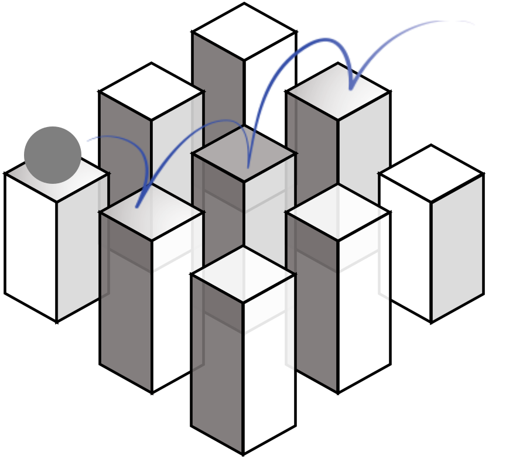

<!--
 * @Date: 2024-11-29 08:08:13
 * @LastEditors: caishaofei caishaofei@stu.pku.edu.cn
 * @LastEditTime: 2024-12-01 08:48:50
 * @FilePath: /MineStudio/docs/source/overview/getting-started.md
-->


# Getting Started

```{toctree}
:caption: Getting started
:hidden:

installation
```

```{toctree}
:caption: MineStudio Libraries
:hidden:

../simulator/index
../data/index
../models/index
../train/index
../inference/index
../benchmark/index
```

Before you start, make sure you have installed [MineStudio](https://github.com/phython96/MineStudio) and its dependencies. 

```{dropdown}  Install MineStudio
```{include} installation.md
```

## MineStudio Libraries Quickstart

Click on the dropdowns for your desired library to get started:
````{dropdown}  Simulator: Customizable Minecraft Environment
```{include} ../simulator/quick-simulator.md
```
```{button-ref}  ../simulator/index
:color: primary
:outline:
:expand:
Learn more about MineStudio Simulator
```
````

````{dropdown}  Data: Flexible Data Structures and Fast Dataloaders
```{include} ../data/quick-data.md
```
````

````{dropdown}  Models: Policy Template and Baselines
```{include} quick-models.md
```
````

````{dropdown}  Train: Training Policy with Offline Data
```{include} quick-train.md
```
````

````{dropdown}  Inference: Parallel Inference and Record Demonstrations
```{include} quick-inference.md
```
````

````{dropdown}  Benchmark: Benchmarking and Evaluation
```{include} quick-benchmark.md
```
````

## Papers

Our library directly supports the following papers:

- [Video PreTraining (VPT): Learning to Act by Watching Unlabeled Online Videos](https://arxiv.org/abs/2206.11795)
- [STEVE-1: A Generative Model for Text-to-Behavior in Minecraft](https://arxiv.org/abs/2306.00937)
- [GROOT: Learning to Follow Instructions by Watching Gameplay Videos](https://arxiv.org/abs/2310.08235)
- [ROCKET-1: Mastering Open-World Interaction with Visual-Temporal Context Prompting](https://arxiv.org/abs/2410.17856)